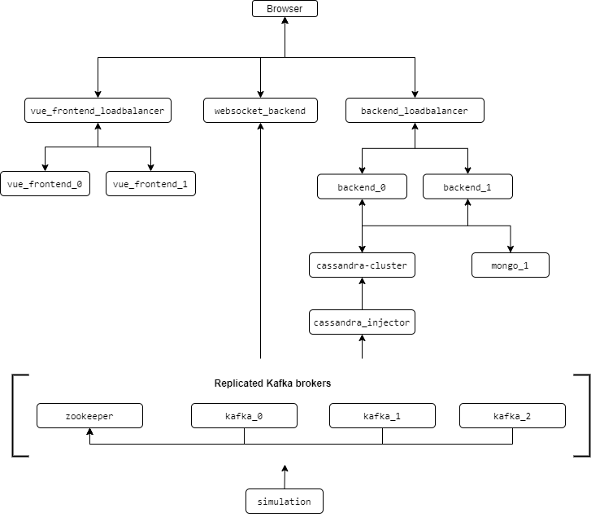

# Flow.io project
This project simulates a real-world water management application. A script generates data simulating a pipeline
infrastructure pumping up water and depositing it at dedicated sink points. On top of this we build an architecture that
is able to robustly handle the potentially large amount of data from all the sensors. The end product is a Single Page
Application (SPA) which shows real-time data from the water pipeline.

## First, some definitions
Unless other contexts are given, these are the terms we use when talking about the underlying simulation.

- pipeline: the simulated water piping network, consisting of ports and basins.
- (pipeline) element: an element in the simulated pipeline, port or basin.
- port: Element for handling input/output to/from the system. Either a pump or a sink.
- pump: port which can produce water, i.e. add water to the system.
- sink: port which can remove water from the system.
- basin: water storage unit.

## Architecture
The entire application infrastructure is composed of docker containers, strung together using `docker-compose`. Several
key containers are used to provide the data streams from the simulation as well as storing the data for later retrieval.
The image below describes the current architecture, as comprised of docker containers.

For details on the architecture, look at the `docker-compose.yml` file or the `README.md` files in the respective
directories.

### Load balancing
Both the `vue_frontend` and `backend` containers are load balanced to deal with incoming HTTP requests. This is done
via setting up an NGINX server, which will divide the workload to the underlying containers, based on the upstream server
options provided.

Given the fact that some requests take longer to resolve (e.g. fetching all historical data), the `leas_conn` selection
protocol is used to divide the load between upstream servers (i.e. `vue_frontend`/`backend` instances).

### Kafka topic replication
Kafka topic replication is achieved by connecting multiple Kafka broker instances to the Zookeeper instance. Moreover,
the environment variables need to be set such as to automatically use a replication factor of 3 for all newly created
topics.

A replication factor of 3 is used to always have an uneven number - and thus always being able to elect a leader.
This makes sure no draw occurs during voting, and our kafka instances don't develop split-brain syndrome.

Topic replication allows for redundancy in the case where one or more brokers (temporarily) dies. If that happens, the
topic information is replicated to the other brokers as well, so that new consumers/producers can still access the desired
topic data.

The obvious down-side of this is the increase demand for hardware. Preferably, these different brokers would be on different
(virtual) machines. In case of a failure the machine will be unavailable, which makes having multiple machines desirable.

Moreover, the brokers not redirect the messages, but also log them for a set duration. Because of this, the replication also
increases the need for disk space. Though, nowadays, this is not much of a problem.

## Technology stack
Key images and technologies are briefly explained next.

### Simulation (`/simulation`)
The container running this image will generate the data about the simulation. It will also push this data to selected
Kafka brokers using a particular topic. These brokers and the topic can be altered in `docker-compose.yml`.

In essence, this is a simple Python script which updates a set of objects every couple of seconds. The simulated pipeline
ports (points of ingress/outgress for the network) increase their production linearly. Moreover, some noise is added
to simulate, well, noise.

### Cassandra (`/cassandra`)
[Cassandra](https://cassandra.apache.org/), a NoSQL database optimized for handling large amounts of data writing/reading. This
makes it perfect for our use case (even though, during the project, in practice we will never be producing a high volume
of said data).

Not only is it fast, it is also easily scaled horizontally by adding more machines/nodes. This means that a sudden increase
in data can be handled relatively easily.

In our case, we create two tables. One is used to store `Port` type sensor updates, the other for `Basin` type updates.
The tables are ordered by timestamp, in descending order. This is done because we can easily fetch the latest updates
for each individual element by grouping the table rows by id value.

### Streaming data into Cassandra (`/cassandra_injector`)
This image will take data from the Kafka message broker and insert them into the Cassandra database for storage. The
Kafka brokers and topic can be set by using environment variables.

This image simply takes a single topic datapoint from the Kafka brokers and inserts it. It is easily scalable to deal with
more data coming in from Kafka, by adding more of these images. Load balancing and fault tolerance is handled in this way,
as each topic datapoint can only be read once by the same consumer group. This is native to Kafka's topics, in particular
the concept of topic offsets.

### MongoDB (`/mongoDB`)
[MongoDB](https://www.mongodb.com/), a document database, is able to store a variety of objects in JSON-like documents.
In our case, we use this to store semi-static data about the pipeline elements. Values such as the installation date,
element location or device model.

Like Cassandra, mongoDB has fault tolerance capabilities by creating multiple mongoDB nodes that store replicates of the database.
However, mongoDB is not as optimized as Cassandra when it comes to high-volume read/writes. Because of this, we used Cassandra
for the sensor data and mongoDB for the more static data.

### API backend (`/backend`)
A node express server that is responsible for serving the RESTful API interfacing with the backend technologies. For
details about the exposed endpoints, see the `README.md` in the directory.

The [Node.js](https://nodejs.org/en/) backend, using a.o. [Express](https://expressjs.com/), connects to the mongoDB and
Cassandra in order to retrieve the data required by the API. The API allows the frontend to be a Single Page Application
(SPA), by providing endpoints that allow the frontend to only show what is needed.

There are two routers included, one pointing to `/historical` and another to `/model`. These govern interactions with Cassandra
and mongoDB, respectively. This is done to make these interactions self-contained/portable.

As mentioned before, several instances of the backend exist, and are load balanced by a NGINX container (`/backend_loadbalancer`)
using upstream servers.

### Websocket backend (`/websocket_backend`)
[Express](https://expressjs.com/), [express-ws](https://www.npmjs.com/package/express-ws) and [websocket-stream](https://www.npmjs.com/package/websocket-stream)
are used to create a webserver with the singular purpose of providing a data stream from Kafka to any client connected
to the exposed websocket.

The websocket is kept separate from the API backend in order to be able to scale the two different container types
differently. The idea behind it is that the workloads for the two containers is considerably different, thus we want to be
able to tweak things individually.

The websocket uses Node.js `streams` to pipe a Kafka consumer to the websocket. Any Kafka message (i.e. element status update)
coming in is first transformed by the pipeline before being sent. Streams are used here to allow for 'backpressure', the
ability for streams earlier in the pipeline to halt producing for a bit before sending more data. This is useful in case
the transform is slower than the data coming in. The streaming data is then buffered for a while.

### Vue.js frontend (`/vue_frontend`)
This image provides a [Vue.js](https://vuejs.org/) frontend SPA. An overview of the latest sensor data of the port and
basin elements are given. When selecting one of the element, a realtime graph is given.

The frontend is built out of several, nested, components in order to create portable pieces of code. For example, the
component for the element table can be reused for both port and basin elements.

[Buefy](https://buefy.org/) is used to simplify and style the components. By using these pre-made components we can easily
create a nice looking frontend. It does increase the disk space required when running, but that is not much of an issue
nowadays, as mentioned earlier.

The package [Vuex](https://vuex.vuejs.org/) to manage state for the app. By using Vuex, we can have components listen to
changes in the data that originate from elsewhere in the app, without having to pass through the data across multiple
components. This greatly reduces complexity.

Moreover, it also adds a layer of consistency in the mostly asynchronous SPA, as each data change is handled individually.
This makes it such that all changes (and corresponding component updates) happen in a logical order.

Lastly, the powerful package [vue-apexcharts](https://apexcharts.com/docs/vue-charts/) is used to create the graphs. It
provides a highly tweakable set of graph types, as well as integrations with the vue app itself. We update the graph using
the latest data coming from a websocket that points to the location of `websocket_backend` containers.

The Vue.js frontend containers are load balanced by the `vue_frontend_loadbalancer` container using the same method as
the backend uses.

## Running the application
The packages `docker` and `docker-compose` need to be installed in order to run the entire architecture locally. All
other requirements are taken care of by the images.

With the prerequisites installed, simply run `docker-compose up --build` in the top-level directory. Wait until the
`websocket_backend` announces that it is logging data, then you can find the web app locally on `http://localhost:8080`.

When wanting to use replicated technologies, use `docker-compose -f docker-compose_replicated.yml up --build`. The default
compose file only has load balancing, in order to reduce the RAM/CPU footprint of the app. In the replicated compose file
Kafka brokers and Cassandra nodes are replicated.
